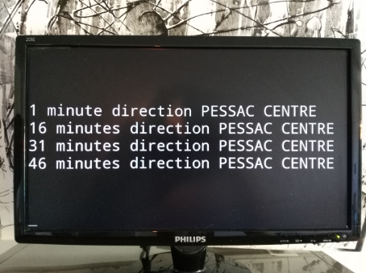

<h1 align="center">Mind the gap</h1>

<p align="center">
  <a href="#"></a>
</p>

<div align="center">
  <strong>Displays the next tram departure</strong>
</div>


&nbsp;&nbsp;&nbsp;&nbsp;&nbsp;&nbsp;&nbsp;&nbsp;&nbsp;&nbsp;&nbsp;&nbsp;&nbsp;&nbsp;&nbsp;&nbsp;&nbsp;&nbsp;&nbsp;&nbsp;&nbsp;&nbsp;&nbsp;&nbsp;&nbsp;&nbsp;&nbsp;&nbsp;&nbsp;&nbsp;&nbsp;&nbsp;&nbsp;&nbsp;&nbsp;&nbsp;&nbsp;&nbsp;&nbsp;&nbsp;&nbsp;&nbsp;&nbsp;&nbsp;&nbsp;&nbsp;&nbsp;&nbsp;&nbsp;&nbsp;&nbsp;

[](https://github.com/tlentali/mind_the_gap/issues)

[](https://opensource.org/licenses/MIT)

### Table of Contents
- [Why](#why)
- [Installation](#installation)
- [Usage](#usage)
- [Config](#config)
- [Result](#result)

## Why ?

Because :  
> ```Ailleurs``` est un mot plus beau que ```demain```.  
> **S. Lapaque**

## Installation

```
$ pip install -r requirement.txt
```
You need a webdriver, to get the Firefox one :
- Download [geckodriver](https://github.com/mozilla/geckodriver/releases)
- Copy geckodriver in /usr/local/bin (sudo mode)

[source_1](https://stackoverflow.com/questions/40208051/selenium-using-python-geckodriver-executable-needs-to-be-in-path)  
[source_2](https://gist.github.com/ziadoz/3e8ab7e944d02fe872c3454d17af31a5)

## Usage

In a terminal :  
```bash
$ ./launch.sh
```

Then open a browser and go to :  
[http://127.0.0.1:5000/](http://127.0.0.1:5000/)  

## Config

To adapt Mind_the_gap to your nearest tram station, go to ```config.py``` and change the URL with the one generated by TBM.

## Result
 <p align="center">
  <a href="#"></a>
</p>
